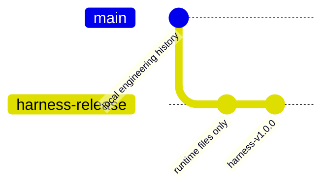

# Harness 1.0

Harness는 Codex 앱에서 프로젝트 폴더 안에 설치해 쓰는 프로젝트 로컬 제작 워크플로우입니다.

별도 Windows 앱이 아니고, Codex 플러그인도 아닙니다. 설치하면 프로젝트 안에 짧은 `AGENTS.md`, Harness 상태 파일, 현재 읽기 목록, 검증 도구가 생깁니다.

## Codex 앱에서 설치

설치할 프로젝트 폴더를 Codex 앱으로 연 뒤 새 채팅에 이렇게 말하면 됩니다.

```text
https://github.com/vibedong/jjamppong/releases/latest 의 Harness 1.0을 이 폴더에 설치해줘.
비공개 저장소면 GitHub CLI의 gh release download로 install-harness.ps1을 받은 뒤 실행해줘.
설치 후 AGENTS.md와 .harness/current/status/STATUS_KO.md를 확인해줘.
```

예를 들어 `mptech` 폴더에서 Codex 앱을 열고 위 문장을 보내면, Harness가 `mptech` 안에 적용됩니다.

## PowerShell 직접 설치

GitHub CLI로 설치 스크립트를 받은 뒤 실행합니다.

```powershell
gh release download --repo vibedong/jjamppong --pattern install-harness.ps1 --dir . --clobber
powershell -NoProfile -ExecutionPolicy Bypass -File .\install-harness.ps1
```

공개 저장소로 전환한 뒤에는 raw URL도 사용할 수 있습니다.

```powershell
iwr -UseBasicParsing https://raw.githubusercontent.com/vibedong/jjamppong/harness-v1.0.0/install-harness.ps1 -OutFile install-harness.ps1
powershell -NoProfile -ExecutionPolicy Bypass -File .\install-harness.ps1
```

## 설치 결과

설치 후 프로젝트에는 다음이 생깁니다.

- `AGENTS.md`: Codex가 Harness 상태와 읽기 목록을 먼저 보도록 하는 라우터
- `.harness/current/status/STATUS_KO.md`: 현재 Harness 상태
- `.harness/manifests/CURRENT_READ_SET.json`: Codex가 우선 읽을 파일 목록
- `.harness/current/source_identity/SOURCE_IDENTITY.json`: 설치 출처와 버전
- `tools/harness-validator/`: Harness 검증 도구

기존 프로젝트에 `AGENTS.md`가 있으면 지우지 않고 Harness 블록을 추가합니다. 기존 파일 백업은 `.harness/evidence/install/backups/`에 남깁니다.

## 브랜치 구조



GitHub 배포 브랜치인 `harness-release`에는 최종 작동 파일만 둡니다. 설계 과정, 감사 보고서, 작업 증거, 과거 검토 패킷은 GitHub 배포 표면에 포함하지 않습니다.

## 검증

Harness 저장소에서는 다음 테스트로 설치와 검증 도구를 확인합니다.

```powershell
python -B -m unittest discover -s tools/harness-validator/tests
```

## 보안

API key, password, authentication token, recovery code 같은 secret은 Git이나 일반 프로젝트 문서에 저장하지 않습니다.
